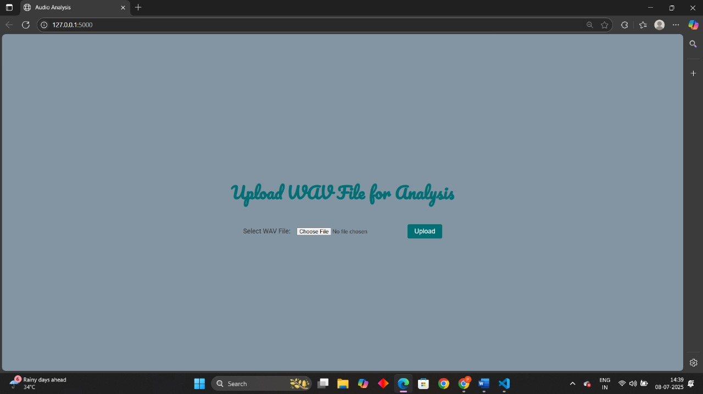
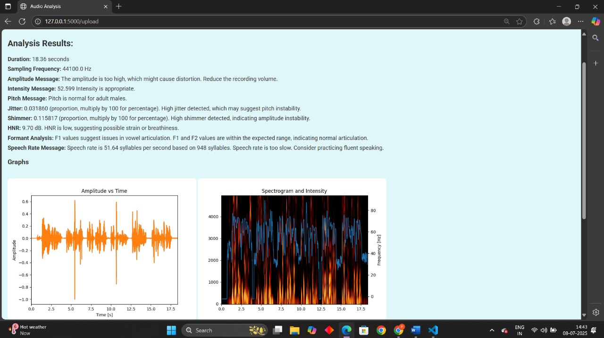
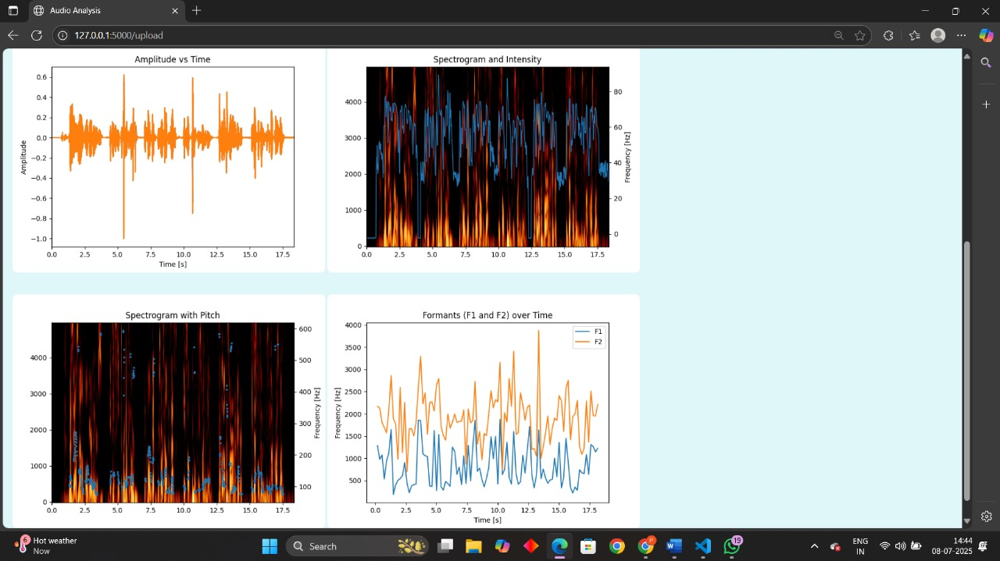

# SpeakSmart

Welcome to **SpeakSmart**, your ultimate destination for innovative speech therapy solutions. Our platform is designed to empower individuals by analyzing their voice and providing personalized therapy options. Whether you prefer guidance from professional therapists or AI-driven therapy sessions, we cater to your unique needs.

---

## Project Description

At SpeakSmart, we believe in the power of technology to transform speech therapy. Our advanced analysis tools offer insights into your vocal patterns, helping you understand and improve your speech. With our AI therapy, you can practice and enhance your skills at your own pace, anytime and anywhere.

Dive into our extensive repository, brimming with resources to boost your speech in a fun and engaging way. Experience a gamified learning journey that makes speech improvement enjoyable and rewarding. Join us at SpeakSmart and take the first step towards a more confident and articulate you!

---

## Features

- **Voice Analysis**: Get detailed insights into your vocal patterns, including pitch, amplitude, and speech rate.
- **Personalized Therapy**: Tailored therapy sessions based on your unique vocal analysis.
- **AI-Driven Insights**: Leverage advanced AI technology for effective speech therapy.
- **Gamified Learning**: Engage with interactive resources that make learning enjoyable.
- **User-Friendly Interface**: Easy navigation and interaction for a seamless experience.

---

## Speech Analysis Module

The **Speech Analysis Module** is the heart of SpeakSmart. Here's how it works:

- **Upload Your Voice**  
  Start your session by uploading a `.wav` audio file via our browser-based interface.

- **Voice Analysis using Parselmouth**  
  We use the [Parselmouth](https://parselmouth.readthedocs.io/) library (a Python interface to Praat) to extract key speech features:
  - **Pitch** (fundamental frequency)
  - **Amplitude** (volume levels)
  - **Speech Rate**
  - **Formants** and **spectral patterns**

- **Visual Feedback**  
  Leveraging **NumPy** and **Matplotlib**, the analysis results are transformed into beautiful, easy-to-understand graphs — giving users a clear idea of their vocal performance.

- **Web Audio API for Recording**  
  We use the **Web Audio API** to support browser-based voice recordings, making it super smooth and accessible.

- **AI-Backed Recommendations**  
  Based on your analysis results, we provide customized suggestions and interactive practice tasks designed to improve your specific speech parameters.

---

### Screenshots

  

<i>Upload Audio Page</i>

  

<i>Graph Analysis - Pitch & Amplitude</i>

  

<i>Therapy Recommendations Dashboard</i>

> From uploading voice ➡️ seeing the analysis ➡️ to engaging therapy — it's all in one place!

---

## Tech Stack

| Layer       | Tech Used                        |
|-------------|----------------------------------|
| Backend     | Python, Flask, Parselmouth       |
| Frontend    | HTML, CSS, JavaScript            |
| Audio Input | Web Audio API                    |
| Graphs      | NumPy, Matplotlib                |

---

## Getting Started

To run this project locally, follow these steps:

1. *Clone the repository*:
   bash
   git clone https://github.com/Rahulkumar003/speaksmart.git
   cd speaksmart
   

2. *Install dependencies*:
   bash
   npm install
   

3. *Run the development server*:
   bash
   npm run dev
   

4. *Open your browser and navigate to*:
   
   http://localhost:3000
   

## Available Scripts

- dev: Starts the development server.
- build: Builds the app for production.
- lint: Runs ESLint to check for code quality.
- preview: Previews the production build.

## Plugins

Currently, two official plugins are available:

- [@vitejs/plugin-react](https://github.com/vitejs/vite-plugin-react/blob/main/packages/plugin-react/README.md) uses [Babel](https://babeljs.io/) for Fast Refresh.
- [@vitejs/plugin-react-swc](https://github.com/vitejs/vite-plugin-react-swc) uses [SWC](https://swc.rs/) for Fast Refresh.

## License

This project is licensed under the MIT License.

## Contributing

We welcome contributions! If you have suggestions for improvements or new features, please open an issue or submit a pull request.

## Contact

For any inquiries or feedback, please reach out to us at [rohit22417@iiitd.ac.in], [prakriti22362@iiitd.ac.in], [rahul22391@iiitd.ac.in].

---

Thank you for checking out SpeakSmart! We hope you find it helpful in your speech therapy journey.

